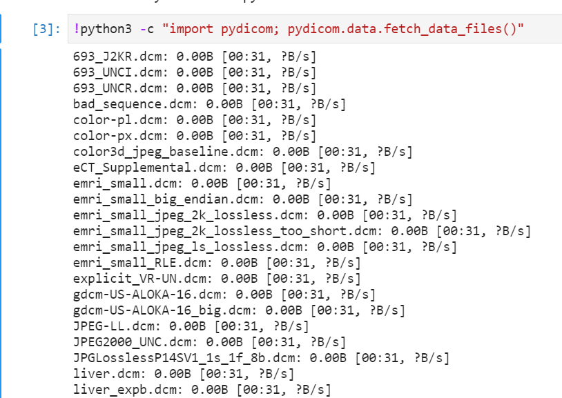

## Prereqs

1. log into lab:
2. log into notebook:
3. select python notebook:


## Install/Configure python environment

0. sanity test
```
!pip3 --version
!python3 --version
```
1. proxy settings

note1: if you are behind corporate proxy you may need to add --proxy flag to commands, else dont include proxy flag
note2: additionally you can configure proxy for git. 
```
!git config --global http.proxy http://web-proxy.corp.hpecorp.net:8080
!git config --global https.proxy http://web-proxy.corp.hpecorp.net:8080
```

2. install packaging, note: if you are not behind corporate proxy; yoy may remove --proxy flag
```
!pip3 install pydicom --proxy http://web-proxy.corp.hpecorp.net:8080
!pip3 install numpy --proxy http://web-proxy.corp.hpecorp.net:8080
!pip3 install pillow --proxy http://web-proxy.corp.hpecorp.net:8080
!pip3 install cython --proxy http://web-proxy.corp.hpecorp.net:8080
!pip3 install pylibjpeg pylibjpeg-libjpeg pylibjpeg-openjpeg --proxy http://web-proxy.corp.hpecorp.net:8080
!pip3 install git+https://github.com/Who8MyLunch/CharPyLS --proxy http://web-proxy.corp.hpecorp.net:8080
```


3. (optionally) download sample data
```
!pip3 install git+https://github.com/pydicom/pydicom-data --proxy http://web-proxy.corp.hpecorp.net:8080
!python3 -c "import pydicom; pydicom.data.fetch_data_files()"
```
note: wait for some time
note2: site packages will be stored in site-packages, i.e:
```
!ls -lrta /home/darian/.local/lib/python3.8/site-packages/pydicom/data/test_files
```




4. add sample code to read from the recently downloaded data and plot the data
```
import matplotlib.pyplot as plt
import pydicom
filename = ("/home/darian/.local/lib/python3.8/site-packages/pydicom/data/test_files/693_J2KI.dcm")
ds = pydicom.dcmread(filename)
plt.imshow(ds.pixel_array, cmap=plt.cm.bone) 
plt.show()
```


docker run -p 4242:4242 -p 8042:8042 --rm jodogne/orthanc /etc/orthanc --verbose