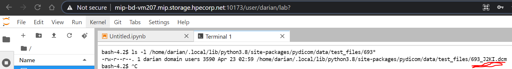

## 1. Install and Configure Notebooks Environment with PyDicom and Sample Data

0. Prereqs

* a) log into lab:
* b) log into notebook:
* c) select python notebook:


0. sanity test


```
!pip3 --version
!python3 --version
```
pip 20.2.4 from /opt/miniconda/lib/python3.8/site-packages/pip (python 3.8)
Python 3.8.5

1. proxy settings

note1: if you are behind corporate proxy you may need to add --proxy flag to commands, else dont include proxy flag
note2: additionally you can configure proxy for git. 
```
!git config --global http.proxy http://web-proxy.corp.hpecorp.net:8080
!git config --global https.proxy http://web-proxy.corp.hpecorp.net:8080
```

2. install packaging, note: if you are not behind corporate proxy; yoy may remove --proxy flag
```
!pip3 install pydicom==2.1.2 --proxy http://web-proxy.corp.hpecorp.net:8080
!pip3 install numpy==1.20.0 --proxy http://web-proxy.corp.hpecorp.net:8080
!pip3 install Pillow==8.0.1 --proxy http://web-proxy.corp.hpecorp.net:8080
!pip3 install cython==0.29.23 --proxy http://web-proxy.corp.hpecorp.net:8080
!pip3 install pylibjpeg-libjpeg==1.1.0 pylibjpeg-openjpeg==1.0.1 pylibjpeg==1.1.1 --proxy http://web-proxy.corp.hpecorp.net:8080
!pip3 install git+https://github.com/Who8MyLunch/CharPyLS --proxy http://web-proxy.corp.hpecorp.net:8080
```


3. (optionally) download sample data
```
!pip3 install git+https://github.com/pydicom/pydicom-data --proxy http://web-proxy.corp.hpecorp.net:8080
!python3 -c "import pydicom; pydicom.data.fetch_data_files()"
```
note: may take up to 10 minutes to download data
note2: site packages will be stored in site-packages, i.e:
```
!ls -lrta /home/darian/.local/lib/python3.8/site-packages/pydicom/data/test_files
```
note3: if you do not wish to download files, you can use the sample that is in this repo




4. add sample code to read from the recently downloaded data and plot the data

```
import matplotlib.pyplot as plt
import pydicom
filename = ("/home/darian/.local/lib/python3.8/site-packages/pydicom/data/test_files/693_J2KI.dcm")
ds = pydicom.dcmread(filename)
plt.imshow(ds.pixel_array, cmap=plt.cm.bone) 
plt.show()
```


5. copy data to the data share

on a terminal

```
bash-4.2$ mkdir -p /bd-fs-mnt/TenantShare/dicom-data
bash-4.2$ cp -r /home/darian/.local/lib/python3.8/site-packages/pydicom/data/test_files /bd-fs-mnt/TenantShare/dicom-data
bash-4.2$ ls -l /bd-fs-mnt/TenantShare/dicom-data/test_files/
```


6. prove that you can visualize data on the tenant share veiw:


## 2. Import/Export data to/from orthanc container. 

note: Future implementation may connect directly to the dataFabric with K8s rerouce definitions and exposed services


1. on 1 termnial, run a sample dicom container provided by Catharina
```
docker run -p 4242:4242 -p 8042:8042 --rm jodogne/orthanc /etc/orthanc --verbose
```
on browser go to <ip>:8042
user: orthanc pass: orthanc


on another terminal, copy files from tenant share to dicom container
```
cd /opt/bluedata/mapr/mnt/picasso/exthcp/tenant-30/fsmount/

```